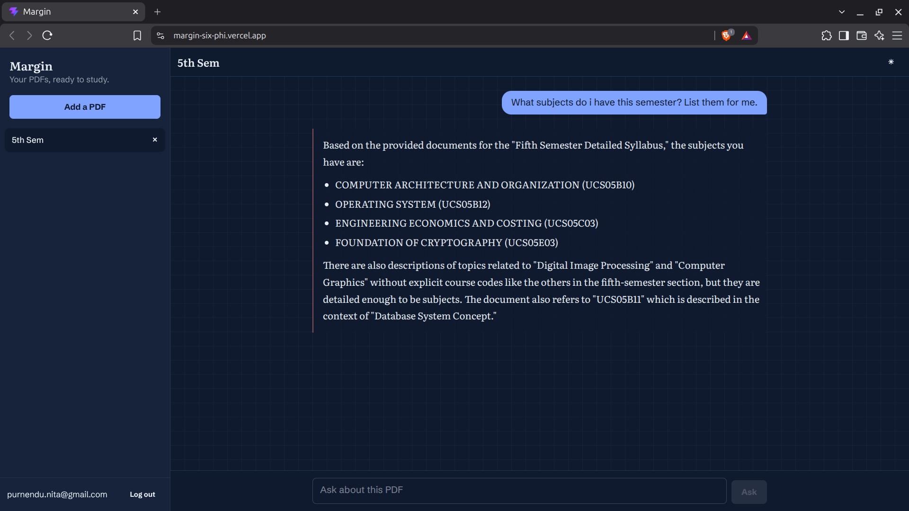

<div align="center">

# 📄 Margin

A RAG-powered document assistant that lets you **upload PDFs, ask questions, and get answers grounded in your documents**.


</div>

---

## 📖 About

**Margin** is a full-stack **Retrieval-Augmented Generation (RAG)** application for interacting with PDF documents.

Upload a document, ask questions about it, and Margin retrieves relevant content before generating an answer using **Google Gemini**.

---

## ✨ Features

* 📄 Upload and process PDF documents
* 🔍 Semantic search using vector embeddings
* 🤖 RAG-based question answering with Gemini
* 💬 Conversational document chat
* 🔐 JWT authentication
* 📚 Document and conversation management
* ✍️ Handwriting OCR support
* 📝 Markdown and code syntax highlighting

---

## 🛠️ Tech Stack

| Technology             | Purpose         |
| ---------------------- | --------------- |
| React                  | Frontend        |
| Tailwind CSS + DaisyUI | UI              |
| Node.js + Express      | Backend         |
| MongoDB + Mongoose     | Database        |
| Pinecone               | Vector Database |
| Google Gemini          | LLM             |
| pdf-parse              | PDF Processing  |

---

## 🧠 RAG Pipeline

```text
PDF
 ↓
Text Extraction
 ↓
Chunking
 ↓
Embeddings
 ↓
Pinecone
 ↓
User Question
 ↓
Semantic Retrieval
 ↓
Gemini
 ↓
Answer
```

---

## 📂 Project Structure

```text
margin/
├── backend/
│   └── src/
│       ├── models/
│       ├── routes/
│       ├── services/
│       └── middleware/
│
├── frontend/
│   └── src/
│       ├── components/
│       ├── App.jsx
│       └── api.jsx
│
└── README.md
```

---

## 🚀 Installation

```bash
git clone https://github.com/Purnendu-404/margin.git
cd margin
```

### Backend

```bash
cd backend
npm install
npm run dev
```

### Frontend

```bash
cd frontend
npm install
npm run dev
```

Create a `.env` file in `backend/` with your MongoDB, Gemini, Pinecone, and JWT credentials.

---

## 📸 Screenshots

### 💬 Document Chat



---

## 📚 What I Learned

* Building a complete RAG pipeline
* Working with vector databases and embeddings
* Integrating LLMs with external knowledge
* Building authenticated full-stack applications
* Connecting React, Express, MongoDB, Pinecone, and Gemini

---

## 🚧 Future Improvements

* Streaming responses
* Better PDF/OCR support
* Source citations
* Multi-document collections
* Improved retrieval accuracy

---

## 👨‍💻 Author

<div align="center">

### **Purnendu Majumder**

[](https://github.com/Purnendu-404)

</div>

---

<div align="center">

⭐ **If you found Margin interesting, consider giving it a star!**

</div>
